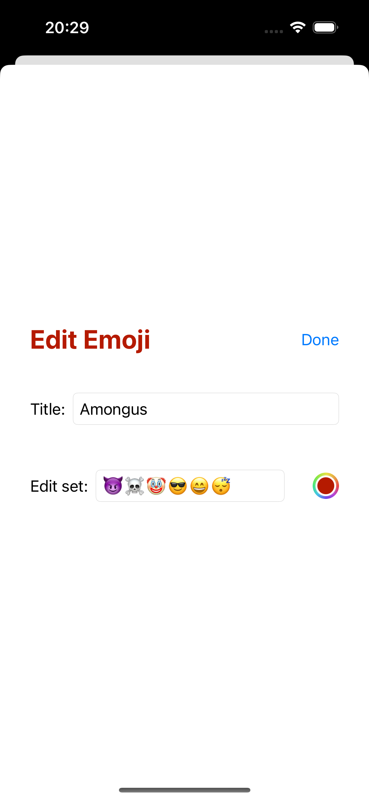

# Emoji Memory Game (SwiftUI)

-----------------------------------------------------
<!--
-->
<!-- -->
<!-- -->
<!-- -->
<!-- -->
<!--
-->

## Table of Contents
1. [Introduction](#introduction)
2. [Code Structure](#code-structure)
3. [Features](#features)
4. [Installation](#installation)
5. [Usage](#usage)
6. [Contributing](#contributing)
7. [License](#license)

## Introduction

The Emoji Memory Game is an iOS application implemented in SwiftUI. The app is a memory game where users match pairs of cards with emoji content. The game incorporates various features, including bonus time, scoring, shuffling, and restarting.

## Code Structure

The codebase is organized into two main files:

- **EmojiMemoryGameView.swift:** Defines the SwiftUI view for the game interface, including the card grid, score display, and interaction elements like shuffle and restart buttons.

- **MemoryGame.swift:** Defines the underlying game logic, card structure, and bonus time calculations.

## Features

### Main Features

- **Card Matching:** Users can tap on cards to reveal their content. Matching pairs of cards increases the score, while mismatches decrease the score.

- **Bonus Time:** Cards have a bonus time limit, and users earn extra points for quick matches within the bonus window.

- **Shuffling:** Users can shuffle the cards to reorganize the deck and create a new game configuration.

- **Restart:** The app allows users to restart the game, resetting the cards and score.

### UI Animation

- **Dealing Animation:** Cards are dealt onto the grid with a smooth animation, creating an engaging user experience.

- **Flying Number Animation:** A flying number animation is displayed when the score changes due to user actions.

- **Card Flip Animation:** Cards flip over with a rotation animation when revealed or matched.

## Installation

To run the Emoji Memory Game on your iOS device or simulator, follow these steps:

1. Clone this repository.
2. Open the project in Xcode.
3. Build and run the app on your device or simulator.

Ensure that you have Xcode installed and the deployment target is set to iOS 13 or later.

## Usage

1. Launch the app.
2. Tap on cards to reveal their content and find matching pairs.
3. Use the shuffle button to reorganize the cards.
4. Restart the game by tapping the restart button.
5. Enjoy bonus points for quick matches within the time limit.

## Contributing

Contributions to this project are welcome. If you would like to contribute, please follow these guidelines:

1. Fork the repository.
2. Create a new branch for your feature or bug fix.
3. Make your changes and test thoroughly.
4. Create a pull request, explaining your changes and providing details on how to test them.

## License

This project is licensed under the [MIT License](LICENSE).

Feel free to reach out to the project maintainers for any questions or feedback. Thank you for playing the Emoji Memory Game!
